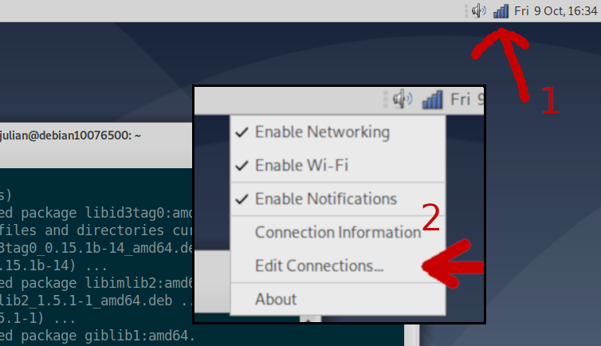
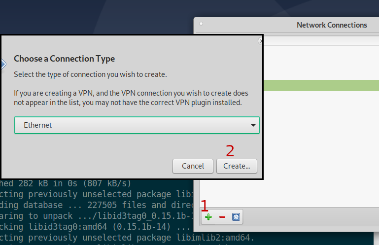
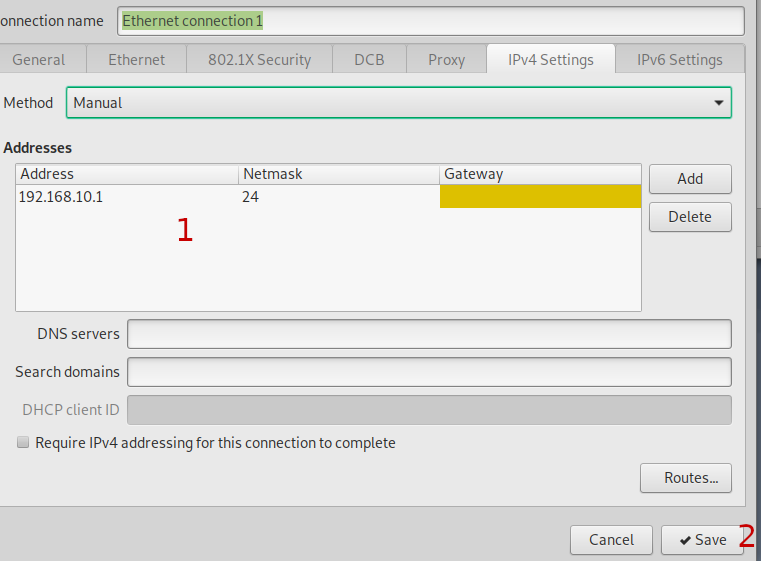
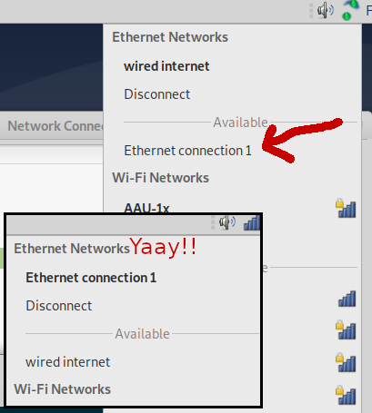

# This guide has not been tested yet

Remove this banner when it has.

# Pc setup guide

This is a short guide on how to setup a pc to communicate with the zedboard.
It is based on the guide provided by openwifi on <https://github.com/open-sdr/openwifi>.

Communication with the zedboard can be done in two different ways.

1. Over ethernet (Used for transferring data and ssh)
2. Over serial line (Used for simple terminal interaction)
3. Over prog usb (Used for programming from Vivado)

## Burning the zedboard image

Start by downloading the image for the `zed_fmcs2`.
This is a compressed archive so uncompress it to a `.img` file.

Burn this file to a microsd card using something like [rufus](https://rufus.ie/)
or dd.

Below is a example burning with dd.

```bash
# First the sdcard name is found
lsblk
> sda      8:0    0 465.8G  0 disk 
> ├─sda1   8:1    0   512M  0 part /boot/efi
> ├─sda2   8:2    0 457.4G  0 part /
> └─sda3   8:3    0   7.9G  0 part [SWAP]
> sdb      8:16   1  14.5G  0 disk 
> ├─sdb1   8:17   1     1G  0 part /media/julian/BOOT
> ├─sdb2   8:18   1   6.4G  0 part /media/julian/rootfs
> └─sdb3   8:19   1     1M  0 part 
> sr0     11:0    1  1024M  0 rom  
# Here its /dev/sdb because its 14.5 gig.
# Next burn the image
sudo dd if=openwifi-1.1.0-taiyuan-3-32bit.img of=/dev/sdb status=progress
```

## Preparing burned sdcard

The sdcard we just burned is very general and therefore contains firmwares for
many different devices.
We must therefore go in and copy some files around.

This section assumes that the zedboard is used.

Start by mounting the boot partition somewhere nice.
This is often done automatically by your operating system.

Next copy the following files:

1. Copy all files in `BOOT/openwifi/zed_fmcs2/` to `BOOT/`.
2. Copy `BOOT/zynq-common/uImage` into `BOOT/`.

**Securely** unmount the sdcard.

## Copy over new kernel module and FPGA firmware.

TODO

## Linux

These are the programs we will be using:
- tio (Creating serial connections, other serial programs should work fine)


Now we can connect to the zedboard from linux.
Start by turning it on.

Then list available serial interfaces and connect to the one that pops up.

```
ls /dev/tty*
> [ 6244.202074] usb 3-1.6: Detected FT232H
> [ 6244.202450] usb 3-1.6: FTDI USB Serial Device converter now attached to ttyUSB0
> [ 6244.238914] usb 2-4: New USB device found, idVendor=04b4, idProduct=0008, bcdDevice= 0.00
> [ 6244.238917] usb 2-4: New USB device strings: Mfr=1, Product=2, SerialNumber=4
> [ 6244.238918] usb 2-4: Product: Cypress-USB2UART-Ver1.0G
> [ 6244.238919] usb 2-4: Manufacturer: 2012 Cypress Semiconductor
> [ 6244.238920] usb 2-4: SerialNumber: 886803053522
> [ 6244.240496] cdc_acm 2-4:1.0: ttyACM0: USB ACM device
> [ 6244.952214] ftdi_sio ttyUSB0: FTDI USB Serial Device converter now disconnected from ttyUSB0
> [ 6244.952237] ftdi_sio 3-1.6:1.0: device disconnected
sudo tio -b 115200 /dev/ttyACM0
> [tio 16:28:05] tio v1.32
> [tio 16:28:05] Press ctrl-t q to quit
> [tio 16:28:05] Connected
```

You now have a terminal connection to the zedboard.

## Connecting via ethernet

The zedboard uses a static ip configuration meaning this must be set on the pc as well.

### Using linux network manager

1. Create a new ethernet connection 




2. Goto ipv4 settings
3. `add` a new address with the settings `address:192.168.10.1,netmask:24,gateway:`.



Attach the ethernet and activate the connection.



### Using linux ip utility

```bash
# First find interface name
ip a
> 1: lo: <LOOPBACK,UP,LOWER_UP> mtu 65536 qdisc noqueue state UNKNOWN mode DEFAULT group default qlen 1000
>     link/loopback 00:00:00:00:00:00 brd 00:00:00:00:00:00
> 2: eno1: <BROADCAST,MULTICAST,UP,LOWER_UP> mtu 1500 qdisc pfifo_fast state UP mode DEFAULT group default qlen 1000
>     link/ether 90:b1:1c:9c:4a:ff brd ff:ff:ff:ff:ff:ff
> 3: wlx00c0ca6f8991: <BROADCAST,MULTICAST,UP,LOWER_UP> mtu 1500 qdisc pfifo_fast state UP mode DORMANT group default qlen 1000
>     link/ether 00:c0:ca:6f:89:91 brd ff:ff:ff:ff:ff:ff
# Then set the ip for the ethernet interface
sudo ip addr add 192.168.10.1/24 dev eno1
```

### Checking the connection

First check the connection using ping.

```bash
ping -c 2 192.168.10.122
> PING 192.168.10.122 (192.168.10.122) 56(84) bytes of data.
> 64 bytes from 192.168.10.122: icmp_seq=1 ttl=64 time=0.145 ms
> 64 bytes from 192.168.10.122: icmp_seq=2 ttl=64 time=0.110 ms
```

The board also starts ssh.
Use username `root` and password `openwifi`.
On windows one must enable the openssh client beforehand.

```bash
ssh root@192.168.10.122
```
